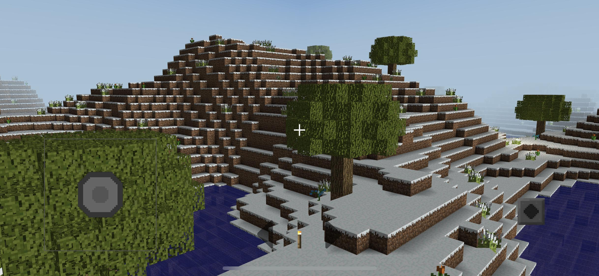
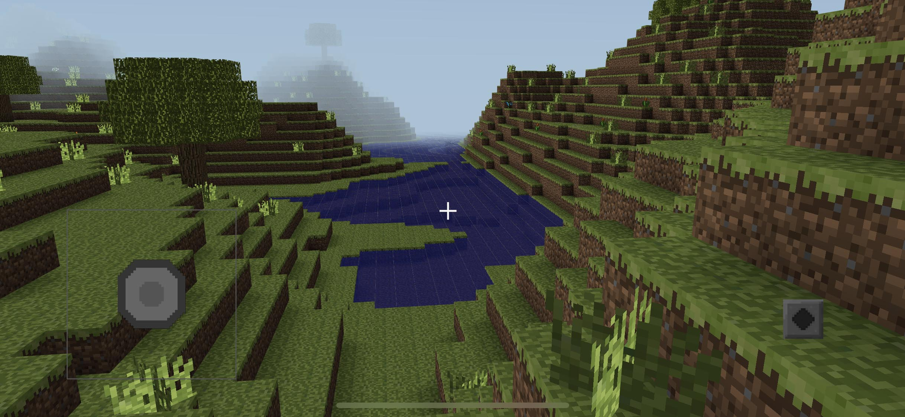
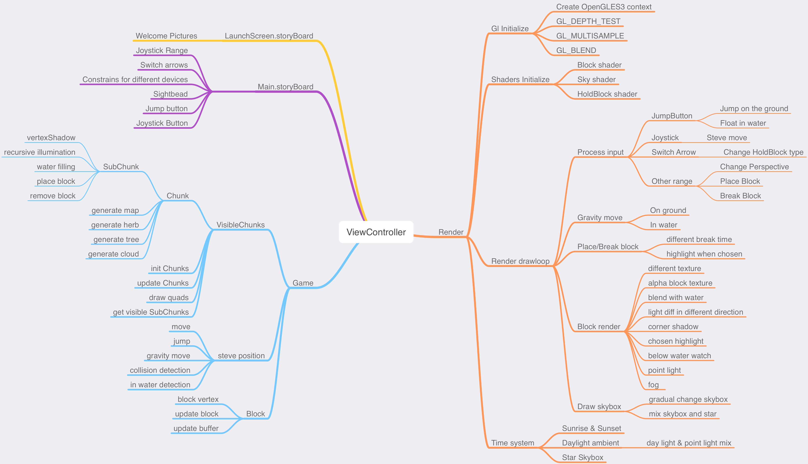
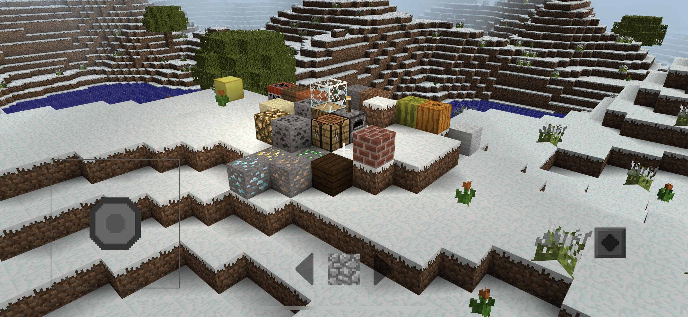
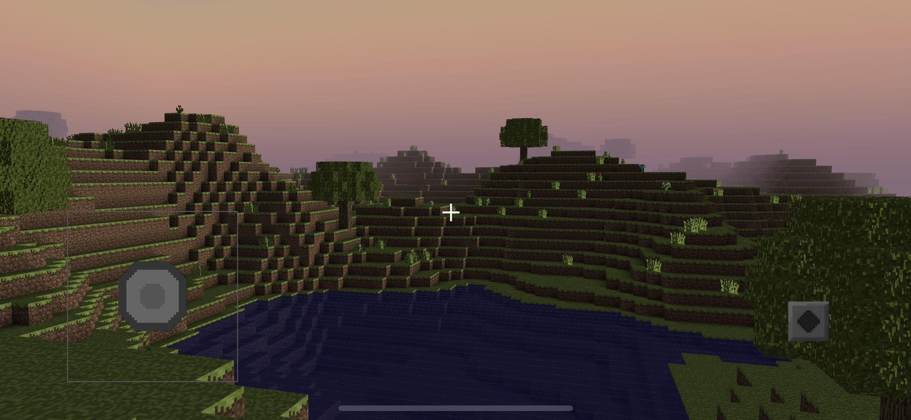
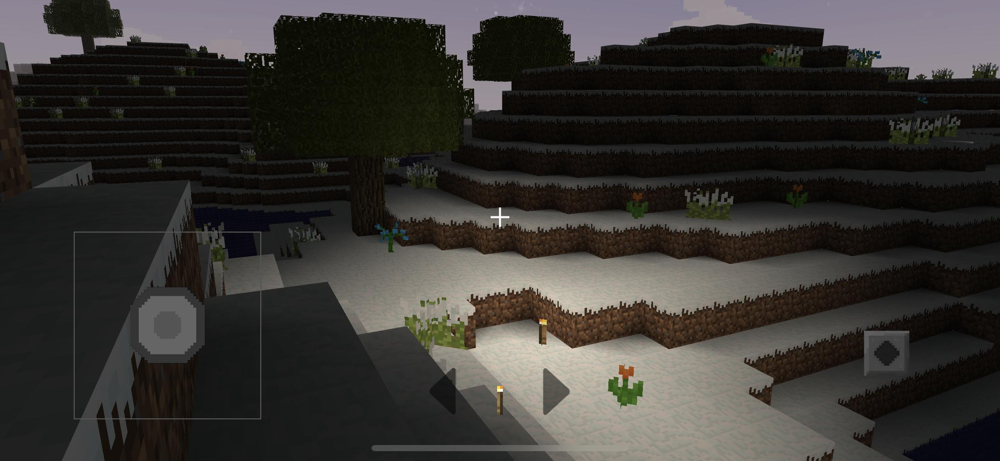
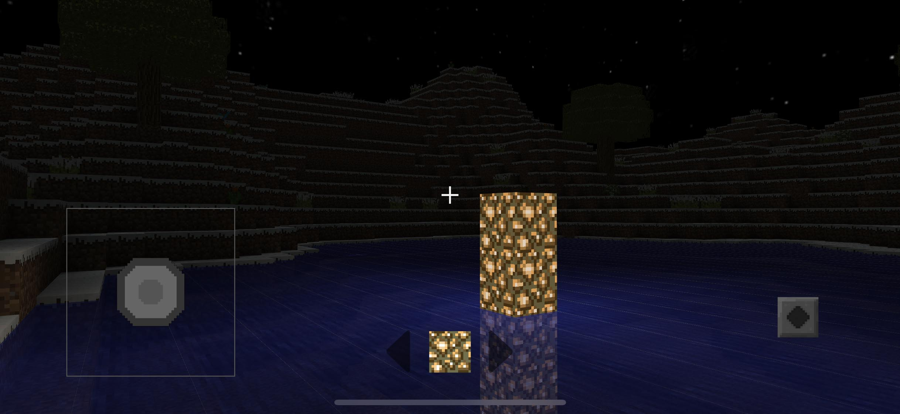
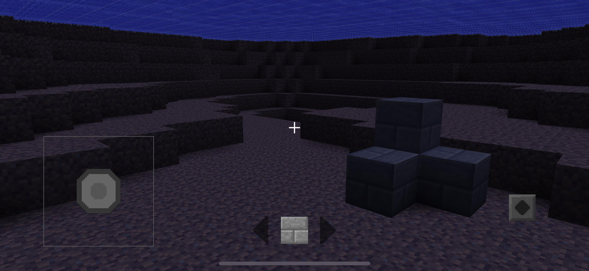
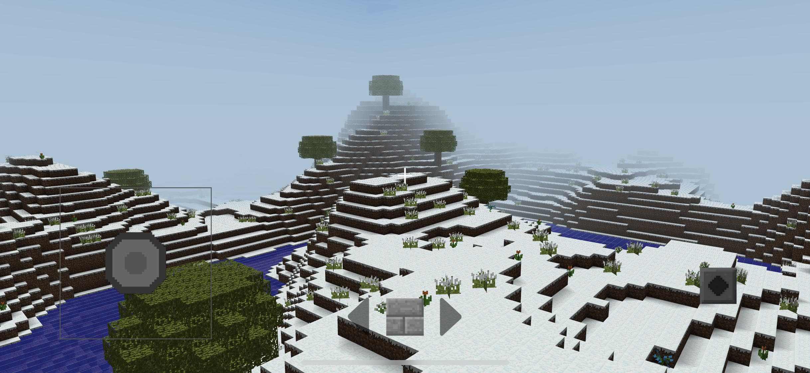
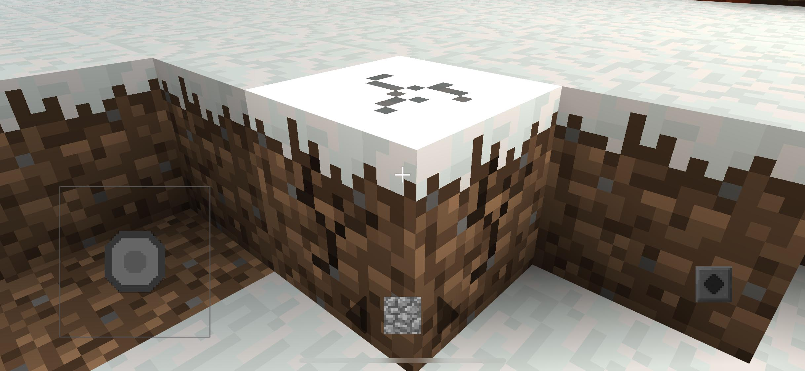

# Mobliecraft

Mobliecraft is a learning-OpenGL iOS project completed in ZJU computer graphics course.

Transplant from my MacOS Version [Mycraft](https://github.com/Clapeysron/Mycraft).

It's a Minecraft clone with lighting effects based on GLKit on iOS use Objective-C & C++ and build with XCode.

## Features

### Render

-   Original block textures from Minecraft
-   Corner shadow to simulate SSAO effect
-   Point light with smooth diffusion from Torch / Glowstone
-   Time pass effect with Gradient sky & Starry sky
-   Animation when break a block / Highlight when choose a block
-   Transparent / translucent block like water / glass
-   Simple gravity engine for on-the-ground and below-water
-   Jitter perspective to simulate running effect
-   Underwater visual effects
-   Fog effect for blocks far away

### Data

-   Infinite random map generation use perlin noise
-   Trees / Flowers / Grass / Cloud / Lake random generation
-   Visible face culling and frustum culling for faster rendering
-   Closed space testing and neighboring visible chunks culling
-   Corner shadow / Point light effect generate and update
-   Adjustable game settings in `src/game_settings.h`
-   Map storage not done yet :(

## Build

### Run

Just use the recent XCode and click run to get the game started

## Game Controls

-   Move fingers on screen to change perspective
-   Virtual joystick to move
-   Tap the screen to place block and press to destroy
-   Switch blocks by ← & → arrows
-   Change all game settings in `src/game_settings.h`

## Architecture Design

## Reference

Tribute to best [Minecraft](https://minecraft.net).

Modern OpenGL example codes from [learnopengl](https://learnopengl.com) and  [learnopengl-cn](https://learnopengl-cn.github.io) (Perfect chinese version :)

Skybox texture & Steve model sources from [Craft](https://github.com/fogleman/Craft).

## Screenshots

### Original Textures

### Sunset

### Point Light

### In-water Point Light

### Underwater Visual Effects

### Fog

### Breaking Animation

